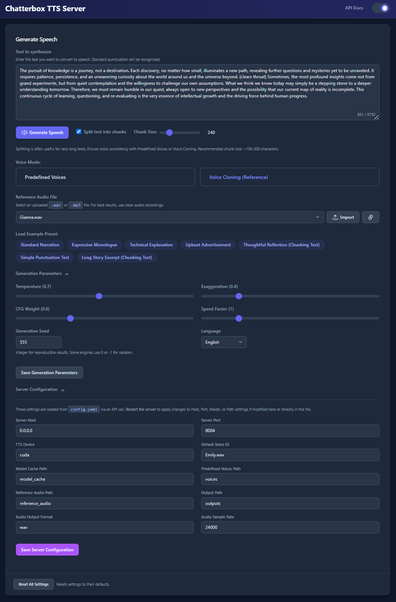
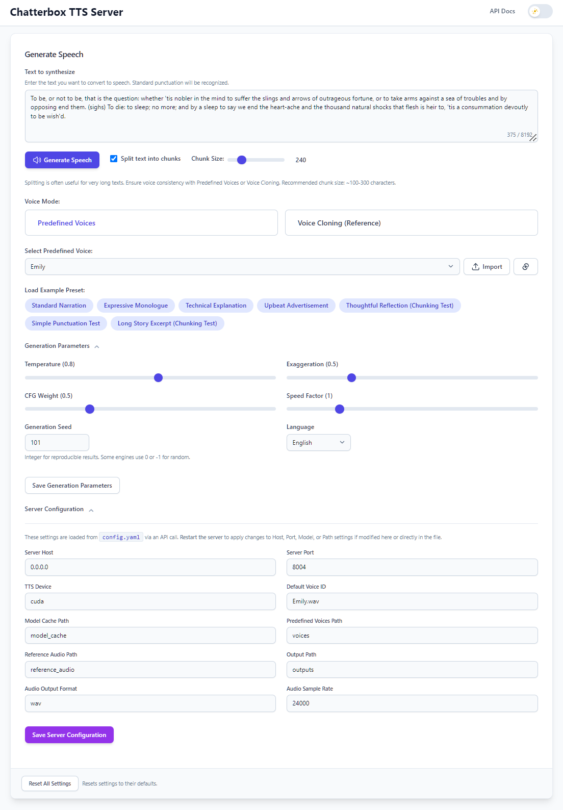

# Chatterbox TTS Server: OpenAI-Compatible API with Web UI, Large Text Handling & Built-in Voices

**Self-host the powerful [Chatterbox TTS model](https://github.com/resemble-ai/chatterbox) with this enhanced FastAPI server! Features an intuitive Web UI, a flexible API endpoint, voice cloning, large text processing via intelligent chunking, and consistent, reproducible voices using built-in ready-to-use voices and a generation seed feature.**

This server is based on the architecture and UI of our [Dia-TTS-Server](https://github.com/devnen/Dia-TTS-Server) project but uses the distinct `chatterbox-tts` engine. Runs accelerated on NVIDIA GPUs (CUDA) with CPU fallback.

[](https://github.com/devnen/Chatterbox-TTS-Server)
[](LICENSE)
[](https://www.python.org/downloads/)
[](https://fastapi.tiangolo.com/)
[](https://github.com/resemble-ai/chatterbox)
[](https://www.docker.com/)
[](#)
[](https://developer.nvidia.com/cuda-zone)

<div align="center">
  
  
</div>

---

## 🗣️ Overview: Enhanced Chatterbox TTS Access

The [Chatterbox TTS model by Resemble AI](https://github.com/resemble-ai/chatterbox) provides capabilities for generating high-quality speech. This project builds upon that foundation by providing a robust **[FastAPI](https://fastapi.tiangolo.com/) server** that makes Chatterbox significantly easier to use and integrate. The server expects plain text input for synthesis.

We solve the complexity of setting up and running the model by offering:

*   A **modern Web UI** for easy experimentation, preset loading, reference audio management, and generation parameter tuning. The interface design draws inspiration from projects like **[Lex-au's Orpheus-FastAPI](https://github.com/Lex-au/Orpheus-FastAPI)**.
*   **Large Text Handling:** Intelligently splits long plain text inputs into manageable chunks based on sentence structure, processes them sequentially, and seamlessly concatenates the audio.
*   **Predefined Voices:** Select from curated, ready-to-use synthetic voices for consistent and reliable output without cloning setup.
*   **Voice Cloning:** Generate speech using a voice similar to an uploaded reference audio file.
*   **Consistent Generation:** Achieve consistent voice output across multiple generations or text chunks by using the "Predefined Voices" or "Voice Cloning" modes, optionally combined with a fixed integer **Seed**.
*   Automatic **GPU (CUDA) acceleration** detection with fallback to CPU.
*   Configuration exclusively via `config.yaml`.
*   **Docker support** for easy containerized deployment with [Docker](https://www.docker.com/).

This server is your gateway to leveraging Chatterbox's TTS capabilities seamlessly, with enhanced stability, voice consistency, and large text support for plain text inputs.

## ✨ Key Features of This Server

This server application enhances the underlying `chatterbox-tts` engine with the following:

**🚀 Core Functionality:**

*   **Large Text Processing (Chunking):**
    *   Automatically handles long plain text inputs by intelligently splitting them into smaller chunks based on sentence boundaries.
    *   Processes each chunk individually and seamlessly concatenates the resulting audio, overcoming potential generation limits of the TTS engine.
    *   Configurable via UI toggle ("Split text into chunks") and chunk size slider.
*   **Predefined Voices:**
    *   Allows usage of curated, ready-to-use synthetic voices stored in the `./voices` directory.
    *   Selectable via UI dropdown ("Predefined Voices" mode).
    *   Provides reliable voice output without manual cloning setup.
*   **Voice Cloning:**
    *   Supports voice cloning using a reference audio file (`.wav` or `.mp3`).
    *   The server processes the reference audio for the engine.
*   **Generation Seed:** Added `seed` parameter to UI and API for influencing generation results. Using a fixed integer seed *in combination with* Predefined Voices or Voice Cloning helps maintain consistency.
*   **API Endpoint (`/tts`):**
    *   The primary API endpoint, offering fine-grained control over TTS generation.
    *   Supports parameters for text, voice mode (predefined/clone), reference/predefined voice selection, chunking control (`split_text`, `chunk_size`), generation settings (temperature, exaggeration, CFG weight, seed, speed factor, language), and output format.
*   **UI Configuration Management:** Added UI section to view/edit `config.yaml` settings (server, model, paths) and save generation defaults.
*   **Configuration System:** Uses `config.yaml` for all runtime configuration, managed via `config.py` (`YamlConfigManager`). If `config.yaml` is missing, it's created with default values from `config.py`.
*   **Audio Post-Processing (Optional):** Includes utilities for silence trimming, internal silence reduction, and (if `parselmouth` is installed) unvoiced segment removal to improve audio quality. These are configurable.
*   **UI State Persistence:** Web UI now saves/restores text input, voice mode selection, file selections, and generation parameters (seed, chunking, sliders) in `config.yaml` (`ui_state` section).

**🔧 General Enhancements:**

*   **Performance:** Optimized for speed and efficient VRAM usage on GPU.
*   **Web Interface:** Modern, responsive UI for plain text input, parameter adjustment, preset loading, reference/predefined audio management, and audio playback.
*   **Model Loading:** Uses `ChatterboxTTS.from_pretrained()` for robust model loading from Hugging Face Hub, utilizing the standard HF cache.
*   **Dependency Management:** Clear `requirements.txt`.
*   **Utilities:** Comprehensive `utils.py` for audio processing, text handling, and file management.

## ✅ Features Summary

*   **Core Chatterbox Capabilities (via [Resemble AI Chatterbox](https://github.com/resemble-ai/chatterbox)):**
    *   🗣️ High-quality single-speaker voice synthesis from plain text.
    *   🎤 Perform voice cloning using reference audio prompts.
*   **Enhanced Server & API:**
    *   ⚡ Built with the high-performance **[FastAPI](https://fastapi.tiangolo.com/)** framework.
    *   ⚙️ **Custom API Endpoint** (`/tts`) as the primary method for programmatic generation, exposing all key parameters.
    *   📄 Interactive API documentation via Swagger UI (`/docs`).
    *   🩺 Health check endpoint (`/api/ui/initial-data` also serves as a comprehensive status check).
*   **Advanced Generation Features:**
    *   📚 **Large Text Handling:** Intelligently splits long plain text inputs into chunks based on sentences, generates audio for each, and concatenates the results seamlessly. Configurable via `split_text` and `chunk_size`.
    *   🎤 **Predefined Voices:** Select from curated synthetic voices in the `./voices` directory.
    *   ✨ **Voice Cloning:** Simple voice cloning using an uploaded reference audio file.
    *   🌱 **Consistent Generation:** Use Predefined Voices or Voice Cloning modes, optionally with a fixed integer **Seed**, for consistent voice output.
    *   🔇 **Audio Post-Processing:** Optional automatic steps to trim silence, fix internal pauses, and remove long unvoiced segments/artifacts (configurable via `config.yaml`).
*   **Intuitive Web User Interface:**
    *   🖱️ Modern, easy-to-use interface.
    *   💡 **Presets:** Load example text and settings dynamically from `ui/presets.yaml`.
    *   🎤 **Reference/Predefined Audio Upload:** Easily upload `.wav`/`.mp3` files.
    *   🗣️ **Voice Mode Selection:** Choose between Predefined Voices or Voice Cloning.
    *   🎛️ **Parameter Control:** Adjust generation settings (Temperature, Exaggeration, CFG Weight, Speed Factor, Seed, etc.) via sliders and inputs.
    *   💾 **Configuration Management:** View and save server settings (`config.yaml`) and default generation parameters directly in the UI.
    *   💾 **Session Persistence:** Remembers your last used settings via `config.yaml`.
    *   ✂️ **Chunking Controls:** Enable/disable text splitting and adjust approximate chunk size.
    *   ⚠️ **Warning Modals:** Optional warnings for chunking voice consistency and general generation quality.
    *   🌓 **Light/Dark Mode:** Toggle between themes with preference saved locally.
    *   🔊 **Audio Player:** Integrated waveform player ([WaveSurfer.js](https://wavesurfer.xyz/)) for generated audio with download option.
    *   ⏳ **Loading Indicator:** Shows status during generation.
*   **Flexible & Efficient Model Handling:**
    *   ☁️ Downloads models automatically from [Hugging Face Hub](https://huggingface.co/) using `ChatterboxTTS.from_pretrained()`.
    *   🔄 Easily specify model repository via `config.yaml`.
    *   📄 Optional `download_model.py` script available to pre-download specific model components to a local directory (this is separate from the main HF cache used at runtime).
*   **Performance & Configuration:**
    *   💻 **GPU Acceleration:** Automatically uses NVIDIA CUDA if available, falls back to CPU.
    *   ⚙️ All configuration via `config.yaml`.
    *   📦 Uses standard Python virtual environments.
*   **Docker Support:**
    *   🐳 Containerized deployment via [Docker](https://www.docker.com/) and Docker Compose.
    *   🔌 NVIDIA GPU acceleration with Container Toolkit integration.
    *   💾 Persistent volumes for models (HF cache), custom voices, outputs, logs, and config.
    *   🚀 One-command setup and deployment (`docker compose up -d`).

## 🔩 System Prerequisites

*   **Operating System:** Windows 10/11 (64-bit) or Linux (Debian/Ubuntu recommended).
*   **Python:** Version 3.10 or later ([Download](https://www.python.org/downloads/)).
*   **Git:** For cloning the repository ([Download](https://git-scm.com/downloads)).
*   **Internet:** For downloading dependencies and models from Hugging Face Hub.
*   **(Optional but HIGHLY Recommended for Performance):**
    *   **NVIDIA GPU:** CUDA-compatible (Maxwell architecture or newer). Check [NVIDIA CUDA GPUs](https://developer.nvidia.com/cuda-gpus).
    *   **NVIDIA Drivers:** Latest version for your GPU/OS ([Download](https://www.nvidia.com/Download/index.aspx)).
    *   **CUDA Toolkit:** Compatible version (e.g., 11.8, 12.1+) matching the PyTorch build you install.
*   **(Linux Only):**
    *   `libsndfile1`: Audio library needed by `soundfile`. Install via package manager (e.g., `sudo apt install libsndfile1`).
    *   `ffmpeg`: For robust audio operations (optional but recommended). Install via package manager (e.g., `sudo apt install ffmpeg`).

## 💻 Installation and Setup

Follow these steps carefully to get the server running.

**1. Clone the Repository**
```bash
git clone https://github.com/devnen/chatterbox-tts-server.git
cd chatterbox-tts-server
```

**2. Set up Python Virtual Environment**

Using a virtual environment is crucial!

*   **Windows (PowerShell):**
    ```powershell
    # In the chatterbox-tts-server directory
    python -m venv venv
    .\venv\Scripts\activate
    # Your prompt should now start with (venv)
    ```

*   **Linux (Bash - Debian/Ubuntu Example):**
    ```bash
    # Ensure prerequisites are installed
    sudo apt update && sudo apt install python3 python3-venv python3-pip libsndfile1 ffmpeg -y

    # In the chatterbox-tts-server directory
    python3 -m venv venv
    source venv/bin/activate
    # Your prompt should now start with (venv)
    ```

**3. Install Dependencies**

Make sure your virtual environment is activated (`(venv)` prefix visible).

```bash
# Upgrade pip (recommended)
pip install --upgrade pip

# Install project requirements
pip install -r requirements.txt
```
⭐ **Note:** This installation includes large libraries like PyTorch and `chatterbox-tts`. The download and installation process may take some time depending on your internet speed and system performance.

⭐ **Important:** The `requirements.txt` typically installs a CPU-compatible version of PyTorch. If you have an NVIDIA GPU, proceed to Step 4 **before** running the server for GPU acceleration.

**4. NVIDIA Driver and CUDA Setup (for GPU Acceleration)**

Skip this step if you only have a CPU.

*   **Step 4a: Check/Install NVIDIA Drivers**
    *   Run `nvidia-smi` in your terminal/command prompt.
    *   If it works, note the **CUDA Version** listed (e.g., 12.1, 11.8). This is the *maximum* your driver supports.
    *   If it fails, download and install the latest drivers from [NVIDIA Driver Downloads](https://www.nvidia.com/Download/index.aspx) and **reboot**. Verify with `nvidia-smi` again.

*   **Step 4b: Install PyTorch with CUDA Support**
    *   Go to the [Official PyTorch Website](https://pytorch.org/get-started/locally/).
    *   Use the configuration tool: Select **Stable**, **Windows/Linux**, **Pip**, **Python**, and the **CUDA version** that is **equal to or lower** than the one shown by `nvidia-smi` (e.g., if `nvidia-smi` shows 12.4, choose CUDA 12.1).
    *   Copy the generated command (it will include `--index-url https://download.pytorch.org/whl/cuXXX`).
    *   **In your activated `(venv)`:**
        ```bash
        # Uninstall the CPU version first (if any was installed by requirements.txt directly)
        pip uninstall torch torchvision torchaudio -y

        # Paste and run the command copied from the PyTorch website
        # Example (replace with your actual command for your CUDA version):
        pip install torch torchvision torchaudio --index-url https://download.pytorch.org/whl/cu121
        ```
    *   ⚠️ **Important: You can safely ignore potential dependency conflicts:**
        After running the command above to install a specific CUDA-enabled PyTorch version, `pip` might display "ERROR: pip's dependency resolver..." messages, often indicating that `chatterbox-tts` (or another package) requires a different version of `torch` or `torchaudio` than the one you just installed (e.g., `chatterbox-tts X.Y.Z requires torch==A.B.C, but you have torch A.B.D+cuXYZ which is incompatible`).
        **For these specific errors related to `torch` and `torchaudio` versions after installing the CUDA variant:** If the CUDA verification in Step 4c is successful (i.e., `torch.cuda.is_available()` returns `True`), these particular dependency conflict messages from `pip` can often be **safely ignored**. The server should still run correctly with GPU acceleration. The key is that PyTorch itself recognizes your CUDA setup.

*   **Step 4c: Verify PyTorch CUDA Installation**
    *   In your activated `(venv)`, run `python` and execute the following single line:
        ```python
        import torch; print(f"PyTorch version: {torch.__version__}"); print(f"CUDA available: {torch.cuda.is_available()}"); print(f"Device name: {torch.cuda.get_device_name(0)}") if torch.cuda.is_available() else None; exit()
        ```
    *   If `CUDA available:` shows `True`, the setup was successful. If `False`, double-check driver installation and the PyTorch install command, and ensure you are in the correct virtual environment.

## ⚙️ Configuration

The server relies exclusively on `config.yaml` for runtime configuration.

*   **`config.yaml`:** Located in the project root. This file stores all server settings, model paths, generation defaults, and UI state. It is created automatically on the first run (using defaults from `config.py`) if it doesn't exist. **This is the main file to edit for persistent configuration changes.**
*   **UI Configuration:** The "Server Configuration" and "Generation Parameters" sections in the Web UI allow direct editing and saving of values *into* `config.yaml`.

**Key Configuration Areas (in `config.yaml` or UI):**

*   `server`: `host`, `port`, logging settings.
*   `model`: `repo_id` (e.g., "ResembleAI/chatterbox").
*   `tts_engine`: `device` ('auto', 'cuda', 'cpu'), `predefined_voices_path`, `reference_audio_path`, `default_voice_id`.
*   `paths`: `model_cache` (for `download_model.py`), `output`.
*   `generation_defaults`: Default UI values for `temperature`, `exaggeration`, `cfg_weight`, `seed`, `speed_factor`, `language`.
*   `audio_output`: `format`, `sample_rate`, `max_reference_duration_sec`.
*   `ui_state`: Stores the last used text, voice mode, file selections, etc., for UI persistence.
*   `ui`: `title`, `show_language_select`, `max_predefined_voices_in_dropdown`.
*   `debug`: `save_intermediate_audio`.

⭐ **Remember:** Changes made to `server`, `model`, `tts_engine`, or `paths` sections in `config.yaml` (or via the UI's Server Configuration section) **require a server restart** to take effect. Changes to `generation_defaults` or `ui_state` are applied dynamically or on the next page load.

## ▶️ Running the Server

**Note on Model Downloads:**
The first time you run the server, `ChatterboxTTS.from_pretrained()` (called by `engine.py`) will download the required model files from Hugging Face Hub to your local Hugging Face cache (e.g., `~/.cache/huggingface/hub`). This may take some time. Monitor the terminal logs for progress. The server starts fully *after* downloads complete.

You can *optionally* use the `python download_model.py` script to pre-download specific model components to the `./model_cache` directory defined in `config.yaml`. However, the runtime engine (`engine.py`) loads the model from the Hugging Face Hub cache directly, not this local `model_cache` directory.

1.  **Activate the virtual environment (if not activated):**
    *   Linux/macOS: `source venv/bin/activate`
    *   Windows: `.\venv\Scripts\activate`
2.  **Run the server:**
    ```bash
    python server.py
    ```
3.  **Access the UI:** The server should automatically attempt to open the Web UI in your default browser after startup. If it doesn't for any reason, manually navigate to `http://localhost:PORT` (e.g., `http://localhost:8000` if default port is 8000).
4.  **Access API Docs:** Open `http://localhost:PORT/docs`.
5.  **Stop the server:** Press `CTRL+C` in the terminal.

## 🐳 Docker Installation

Run Chatterbox TTS Server easily using Docker. The recommended method uses Docker Compose.

### Prerequisites

*   [Docker](https://docs.docker.com/get-docker/) installed.
*   [Docker Compose](https://docs.docker.com/compose/install/) installed (usually included with Docker Desktop).
*   (Optional but Recommended for GPU) NVIDIA GPU with up-to-date drivers and the [NVIDIA Container Toolkit](https://docs.nvidia.com/datacenter/cloud-native/container-toolkit/install-guide.html) installed.

### Using Docker Compose (Recommended)

This method uses `docker-compose.yml` to manage the container, volumes, and configuration easily.

1.  **Clone the repository:**
    ```bash
    git clone https://github.com/devnen/chatterbox-tts-server.git
    cd chatterbox-tts-server
    ```

2.  **Review `docker-compose.yml`:**
    *   The repository includes a `docker-compose.yml` file. Ensure it's configured for your needs (image source, ports, volumes). The provided one in this project is a good starting point.

3.  **Start the container:**
    ```bash
    docker compose up -d --build
    ```
    *   This command will:
        *   Build the Docker image using `Dockerfile` (if not using a pre-built image).
        *   Create local directories specified in volumes (e.g., `voices`, `reference_audio`) if they don't exist on your host.
        *   Start the container in detached mode (`-d`).
    *   The first time the image is built or the container runs, it might download models from Hugging Face Hub, which can take time. These will be cached in a Docker volume.

4.  **Access the UI:**
    Open your web browser to `http://localhost:PORT` (e.g., `http://localhost:8004` or the host port you configured).

5.  **View logs:**
    ```bash
    docker compose logs -f
    ```

6.  **Stop the container:**
    ```bash
    docker compose down
    ```

### Configuration in Docker

*   The server uses `config.yaml` for its settings. The `docker-compose.yml` should mount your local `config.yaml` to `/app/config.yaml` inside the container.
*   If `config.yaml` does not exist locally when you first start, the application inside the container will create a default one (based on `config.py`), which will then appear in your local directory due to the volume mount.
*   You can then edit this local `config.yaml`. Changes to server/model/path settings typically require a container restart (`docker compose restart chatterbox-tts-server`). UI state changes are often saved live by the app.

### Docker Volumes

Persistent data is stored on your host machine via volume mounts defined in `docker-compose.yml`:

*   `./config.yaml:/app/config.yaml` (Main application configuration)
*   `./voices:/app/voices` (Predefined voice audio files)
*   `./reference_audio:/app/reference_audio` (Your uploaded reference audio files for cloning)
*   `./outputs:/app/outputs` (Generated audio files saved from UI/API)
*   `./logs:/app/logs` (Server log files)
*   `hf_cache:/app/hf_cache` (Named volume for Hugging Face model cache to persist downloads, matching `HF_HOME` in Dockerfile)

## 💡 Usage

### Web UI (`http://localhost:PORT`)

The most intuitive way to use the server:

*   **Text Input:** Enter your plain text script.
*   **Voice Mode:** Choose:
    *   `Predefined Voices`: Select a curated voice from the `./voices` directory.
    *   `Voice Cloning`: Select an uploaded reference file from `./reference_audio`.
*   **Presets:** Load examples from `ui/presets.yaml`.
*   **Reference/Predefined Audio Management:** Import new files and refresh lists.
*   **Generation Parameters:** Adjust Temperature, Exaggeration, CFG Weight, Speed Factor, Seed. Save defaults to `config.yaml`.
*   **Chunking Controls:** Toggle "Split text into chunks" and adjust "Chunk Size" for long texts.
*   **Server Configuration:** View/edit parts of `config.yaml` (requires server restart for some changes).
*   **Audio Player:** Play generated audio with waveform visualization.

### API Endpoints (`/docs` for interactive details)

The primary endpoint for TTS generation is `/tts`, which offers detailed control over the synthesis process.

*   **`/tts` (POST):** Main endpoint for speech generation.
    *   **Request Body (`CustomTTSRequest`):**
        *   `text` (string, required): Plain text to synthesize.
        *   `voice_mode` (string, "predefined" or "clone", default "predefined"): Specifies voice source.
        *   `predefined_voice_id` (string, optional): Filename of predefined voice (if `voice_mode` is "predefined").
        *   `reference_audio_filename` (string, optional): Filename of reference audio (if `voice_mode` is "clone").
        *   `output_format` (string, "wav" or "opus", default "wav").
        *   `split_text` (boolean, default True): Whether to chunk long text.
        *   `chunk_size` (integer, default 120): Target characters per chunk.
        *   `temperature`, `exaggeration`, `cfg_weight`, `seed`, `speed_factor`, `language`: Generation parameters overriding defaults.
    *   **Response:** Streaming audio (`audio/wav` or `audio/opus`).
*   **`/v1/audio/speech` (POST):** OpenAI-compatible.
    *   `input`: Text.
    *   `voice`: 'S1', 'S2', 'dialogue', 'predefined_voice_filename.wav', or 'reference_filename.wav'.
    *   `response_format`: 'opus' or 'wav'.
    *   `speed`: Playback speed factor (0.5-2.0).
    *   `seed`: (Optional) Integer seed, -1 for random.    
*   **Helper Endpoints (mostly for UI):**
    *   `GET /api/ui/initial-data`: Fetches all initial configuration, file lists, and presets for the UI.
    *   `POST /save_settings`: Saves partial updates to `config.yaml`.
    *   `POST /reset_settings`: Resets `config.yaml` to defaults.
    *   `GET /get_reference_files`: Lists files in `reference_audio/`.
    *   `GET /get_predefined_voices`: Lists formatted voices from `voices/`.
    *   `POST /upload_reference`: Uploads reference audio files.
    *   `POST /upload_predefined_voice`: Uploads predefined voice files.

## 🔍 Troubleshooting

*   **CUDA Not Available / Slow:** Check NVIDIA drivers (`nvidia-smi`), ensure correct CUDA-enabled PyTorch is installed (Installation Step 4).
*   **VRAM Out of Memory (OOM):**
    *   Ensure your GPU meets minimum requirements for Chatterbox.
    *   Close other GPU-intensive applications.
    *   If processing very long text even with chunking, try reducing `chunk_size` (e.g., 100-150).
*   **Import Errors (e.g., `chatterbox-tts`, `librosa`):** Ensure virtual environment is active and `pip install -r requirements.txt` completed successfully.
*   **`libsndfile` Error (Linux):** Run `sudo apt install libsndfile1`.
*   **Model Download Fails:** Check internet connection. `ChatterboxTTS.from_pretrained()` will attempt to download from Hugging Face Hub. Ensure `model.repo_id` in `config.yaml` is correct.
*   **Voice Cloning/Predefined Voice Issues:**
    *   Ensure files exist in the correct directories (`./reference_audio`, `./voices`).
    *   Check server logs for errors related to file loading or processing.
*   **Permission Errors (Saving Files/Config):** Check write permissions for `./config.yaml`, `./logs`, `./outputs`, `./reference_audio`, `./voices`, and the Hugging Face cache directory if using Docker volumes.
*   **UI Issues / Settings Not Saving:** Clear browser cache/local storage. Check browser developer console (F12) for JavaScript errors. Ensure `config.yaml` is writable by the server process.
*   **Port Conflict (`Address already in use`):** Another process is using the port. Stop it or change `server.port` in `config.yaml` (requires server restart).
*   **Generation Cancel Button:** This is a "UI Cancel" - it stops the *frontend* from waiting but doesn't instantly halt ongoing backend model inference. Clicking Generate again cancels the previous UI wait.

### Selecting GPUs on Multi-GPU Systems

Set the `CUDA_VISIBLE_DEVICES` environment variable **before** running `python server.py` to specify which GPU(s) PyTorch should see. The server uses the first visible one (effectively `cuda:0` from PyTorch's perspective).

*   **Example (Use only physical GPU 1):**
    *   Linux/macOS: `CUDA_VISIBLE_DEVICES="1" python server.py`
    *   Windows CMD: `set CUDA_VISIBLE_DEVICES=1 && python server.py`
    *   Windows PowerShell: `$env:CUDA_VISIBLE_DEVICES="1"; python server.py`

*   **Example (Use physical GPUs 6 and 7 - server uses GPU 6):**
    *   Linux/macOS: `CUDA_VISIBLE_DEVICES="6,7" python server.py`
    *   Windows CMD: `set CUDA_VISIBLE_DEVICES=6,7 && python server.py`
    *   Windows PowerShell: `$env:CUDA_VISIBLE_DEVICES="6,7"; python server.py`

**Note:** `CUDA_VISIBLE_DEVICES` selects GPUs; it does **not** fix OOM errors if the chosen GPU lacks sufficient memory.
## 🤝 Contributing

Contributions are welcome! Please feel free to open an issue to report bugs or suggest features, or submit a Pull Request for improvements.

## 📜 License

This project is licensed under the **MIT License**.

You can find it here: [https://opensource.org/licenses/MIT](https://opensource.org/licenses/MIT)

## 🙏 Acknowledgements

*   **Core Model:** This project utilizes the **[Chatterbox TTS model](https://github.com/resemble-ai/chatterbox)** by **[Resemble AI](https://www.resemble.ai/)**.
*   **UI Inspiration:** Special thanks to **[Lex-au](https://github.com/Lex-au)** whose **[Orpheus-FastAPI](https://github.com/Lex-au/Orpheus-FastAPI)** project served as inspiration for the web interface design.
*   **Similar Project:** This server shares architectural similarities with our [Dia-TTS-Server](https://github.com/devnen/Dia-TTS-Server) project, which uses a different TTS engine.
*   **Containerization Technologies:** [Docker](https://www.docker.com/) and [NVIDIA Container Toolkit](https://github.com/NVIDIA/nvidia-docker).
*   **Core Libraries:**
    *   [FastAPI](https://fastapi.tiangolo.com/)
    *   [Uvicorn](https://www.uvicorn.org/)
    *   [PyTorch](https://pytorch.org/)
    *   [Hugging Face Hub](https://huggingface.co/docs/huggingface_hub/index) & [SafeTensors](https://github.com/huggingface/safetensors)
    *   [Descript Audio Codec (DAC)](https://github.com/descriptinc/descript-audio-codec)
    *   [SoundFile](https://python-soundfile.readthedocs.io/) & [libsndfile](http://www.mega-nerd.com/libsndfile/)
    *   [Jinja2](https://jinja.palletsprojects.com/)
    *   [WaveSurfer.js](https://wavesurfer.xyz/)
    *   [Tailwind CSS](https://tailwindcss.com/) (via CDN)

---
